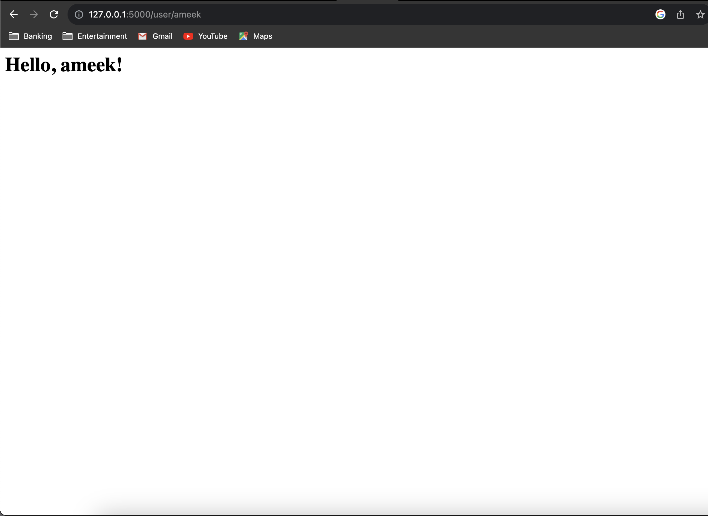
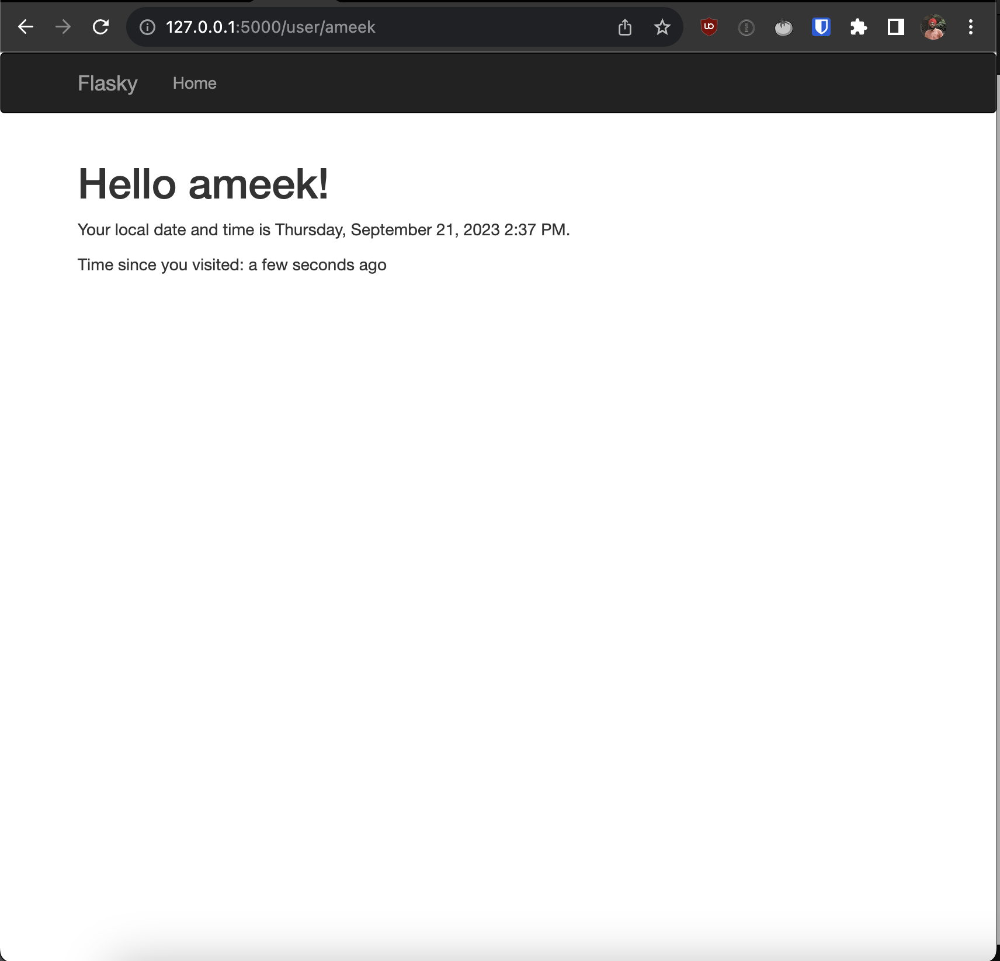
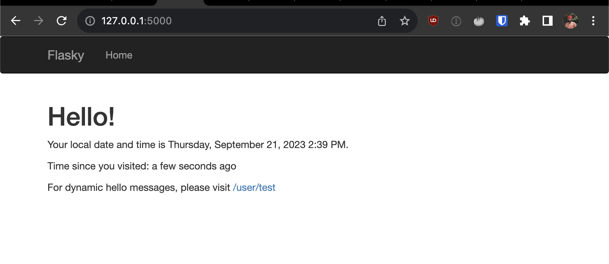
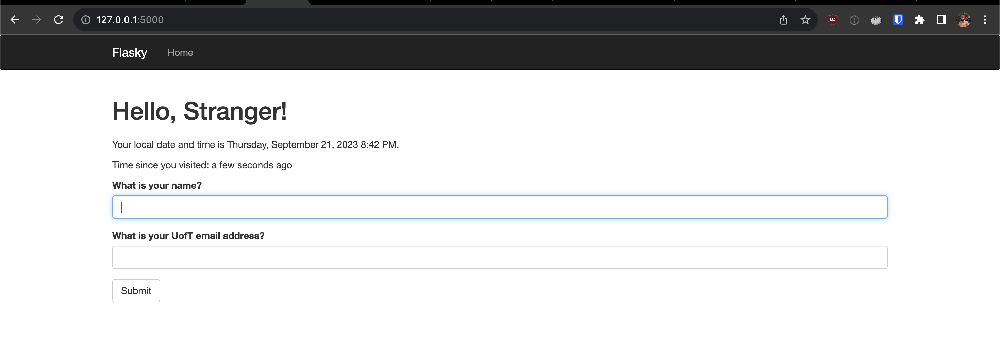
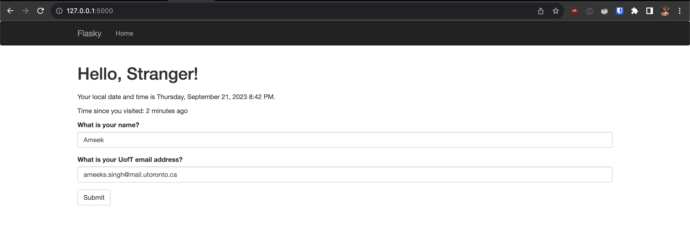
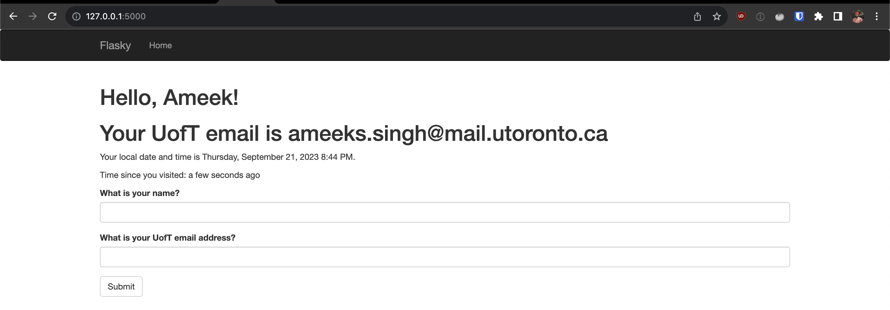
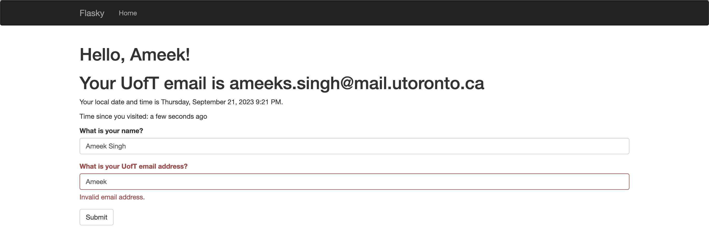
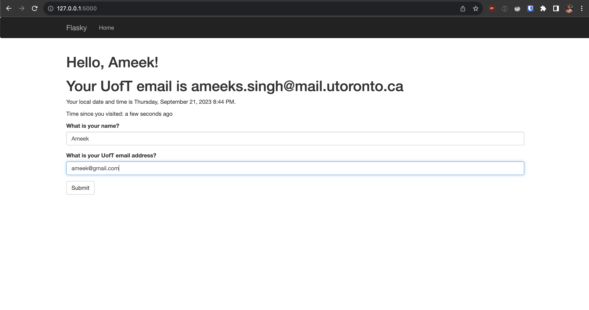
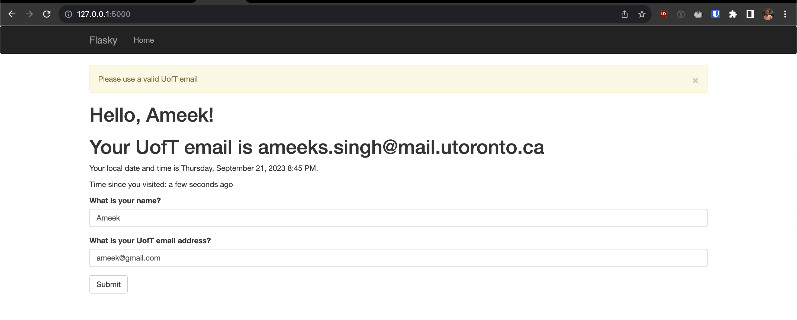

This repo is a clone of https://github.com/miguelgrinberg/flasky

## References for git commands:
https://git-scm.com/docs/git-reset, https://git-scm.com/book/en/v2/Git-Basics-Undoing-Things

## Activity 2 - successfully recreated Example 2-2

## Activity 3 - successfully recreated example in chapter 3
### On `user/ameek`

### On `index`

## Activity 4 
### Default form state

### Form state with UofT mail

### Form state with non e-mail

### Form state with non-UofT email

