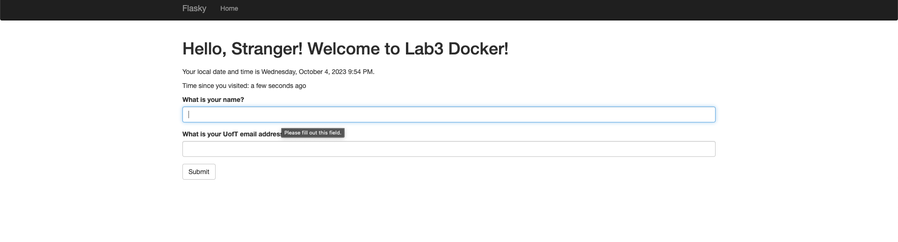

## Lab 3 - Docker

### Activity 2 - Succesfully installed docker

### Activity 3
#### No user name provided

#### User name provided

### Activity 4
#### Docker install
>Note: Had some issues with completing this install, specifically, the script failing at step `apt-get update`. Restarted machine after following https://stackoverflow.com/questions/42740767/docker-build-on-apt-get-update-fails which fixed the issue.

#### Running docker on port 3000, and trying to run docker ps

#### Output of docker ps

#### Screenshot of local browser window
